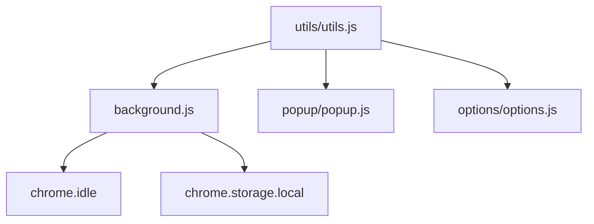

# Design: Core Architecture Optimization

## Architecture Overview

The project will move from standalone scripts to an ES module-based architecture.

## Key Mechanisms

### 1. Idle Detection

Integration with `chrome.idle.onStateChanged`.

- When state is `idle` or `locked`, `updateTimeSpent()` is called and `currentTab.startTime` is set to `null`.
- When state returns to `active`, `startTime` is reset to `Date.now()`.

### 2. Optimized Persistence

Instead of a fixed interval `setInterval(saveTimeDataToStorage, 10000)`, we will:

- Introduce a `isDirty` flag in `background.js`.
- Set `isDirty = true` whenever `timeDataCache` is modified.
- Check `isDirty` in the interval; only save if true, then reset `isDirty = false`.

### 3. Shared Utilities

A new module `utils/utils.js` will export:

- `extractDomain(url)`
- `formatTime(ms)`
- `getTodayString()`
- `applyTheme(theme)`

## Trade-offs

- **Complexity**: ES modules add a slight overhead in file management but vastly improve maintainability.
- **Idle Accuracy**: Detection depends on the system's idle threshold (default 15s), but it's more accurate than the current "always counting" approach.
